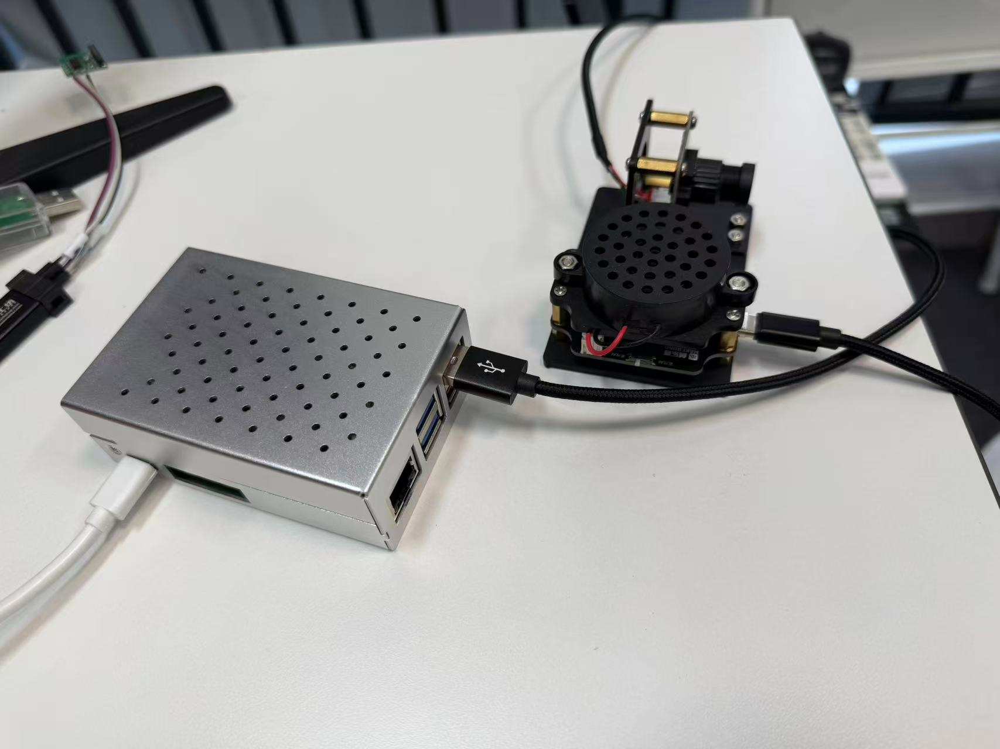

# 🎙️ VoicePilot 语伴

<div align="center">


**离线部署 · 本地推理 · 隐私安全 · 边缘友好**

一个完全本地部署的离线语音助手系统，无需联网即可运行。集成多语言语音识别、轻量化大语言模型和语音合成功能，专为树莓派等低成本边缘设备设计。

[功能特性](#-功能特性) • [快速开始](#-快速开始) • [配置说明](#-配置参数) • [故障排除](#-故障排除)

</div>

---

## 💡 简介

**VoicePilot 语伴** 是一个注重隐私的本地语音助手。所有语音识别、语义理解和语音合成均在本地完成，数据不上传云端，确保您的对话隐私安全。



### 核心优势

| 特性 | 说明 |
|------|------|
| 🔒 **隐私安全** | 完全本地运行，数据不离开设备 |
| 🌐 **离线可用** | 无需网络连接，随时随地使用 |
| 💻 **轻量部署** | 支持4GB内存设备，树莓派友好 |
| 🗣️ **多语言** | 支持中英日韩粤语多语言混合识别 |
| ⚡ **实时响应** | CPU推理，秒级语音响应 |

## ✨ 功能特性

本项目实现了一个完整的离线语音助手，支持：
- **语音识别 (ASR)**: SenseVoiceSmall 多语言语音识别
- **大语言模型 (LLM)**: Qwen3-0.6B GGUF 格式轻量化模型
- **语音合成 (TTS)**: Edge-TTS 在线文字转语音服务
- **实时语音活动检测**: 基于音量触发的语音检测

## 🏗️ 系统架构

```
用户语音 → 音量触发检测 → ASR识别 → LLM推理 → TTS合成 → 语音输出
              ↓
         保存音频文件
```

## 📂 项目结构

```
local_LLM_test/
├── voice_assistant.py                   # 主要代码：完整语音助手系统
├── requirements.txt                     # 依赖清单
├── experiments/                         # 实验代码目录
│   ├── 1.声卡设备测试实验.py             # 麦克风设备静音/取消静音测试
│   ├── 2.测试AI模块录音功能实验.py       # 录音和播放功能测试
│   ├── 3.edgeTTS语音合成实验.py         # Edge-TTS文字转语音测试
│   ├── 7.2.基于fsmn-vad...py           # 使用fsmn-vad的实时语音识别
│   ├── 13.离线部署SenceVoice...py       # 使用webrtcvad的完整系统(Qwen2.5)
│   ├── realtime_sensevoice.py           # SenseVoice实时语音识别
│   ├── realtime_stt.py                  # 简化版实时语音转文字
│   ├── audio_only.py                    # 仅音频处理版本
│   ├── gguf_infer_2.py                  # GGUF模型推理测试
│   └── TTS.py                           # SenseVoice推理脚本
├── SenseVoiceSmall/                     # SenseVoice ASR模型目录
│   ├── model.pt                         # 模型权重
│   ├── config.yaml                      # 模型配置
│   └── ...
├── qwen3-0.6B-gguf/                     # Qwen3 GGUF模型目录
│   └── qwen3_0.6B_q4_k_m.gguf          # 量化模型文件
├── example/                             # 测试音频文件
│   ├── zh.mp3                           # 中文测试音频
│   ├── en.mp3                           # 英文测试音频
│   └── ...
├── output/                              # 输出音频目录
└── finetune_model/                      # 微调模型目录
```

## 📋 环境要求

### 硬件
| 组件 | 要求 |
|------|------|
| 💻 CPU | 4核心以上 (推荐树莓派5或同等性能设备) |
| 🧠 内存 | 4GB+ 推荐 |
| 🎤 麦克风 | 必需 |
| 🔊 扬声器 | 必需 |

### 软件
- 🐍 **Python 3.8+**
- 🐧 **Linux系统** (推荐Ubuntu/Debian)

## 🛠️ 安装步骤

### 1. 安装系统依赖

```bash
# 安装PortAudio库 (pyaudio依赖)
sudo apt-get install portaudio19-dev

# 安装PyAudio
pip install pyaudio

# 或在树莓派上
sudo apt-get install python3-pyaudio
```

### 2. 安装Python依赖

```bash
# 核心依赖
pip install pyaudio wave numpy pygame edge-tts

# ASR依赖
pip install funasr[onnxruntime]

# LLM依赖
pip install llama-cpp-python

# 其他依赖
pip install torch sounddevice soundfile webrtcvad langid langdetect
```

### 3. 下载模型

#### SenseVoice ASR模型
```bash
# 模型已包含在 SenseVoiceSmall/ 目录
# 或从 FunASR 官方仓库下载
```

#### Qwen3 GGUF模型
```bash
# 从ModelScope或HuggingFace下载GGUF格式模型
# 放置在 qwen3-0.6B-gguf/ 目录
```

## 快速开始

### 运行主程序

```bash
python voice_assistant.py
```

程序运行后会：
1. 自动加载ASR和LLM模型
2. 进入监听状态
3. 检测到语音后自动开始录音
4. 识别完成后进行LLM推理
5. 将结果通过TTS合成并播放

### 配置参数

在 `voice_assistant.py` 中的 `Config` 类可调整：

```python
class Config:
    OUTPUT_DIR = "./output"              # 输出目录
    MODEL_DIR_SENSEVOICE = "./SenseVoiceSmall"
    MODEL_PATH_LLM = "./qwen3-0.6B-gguf/qwen3_0.6B_q4_k_m.gguf"

    AUDIO_RATE = 48000                   # 音频采样率
    CHUNK = 4096                         # 音频缓冲区大小
    MIN_VOLUME = 500                     # 音量触发阈值
    SILENCE_TIMEOUT = 1.0                # 静音超时时间(秒)

    SYSTEM_PROMPT = "你叫千问，是..."    # 系统提示词
```

### 参数调优

| 参数 | 说明 | 调低 | 调高 |
|------|------|------|------|
| MIN_VOLUME | 音量触发阈值 | 更灵敏 | 更严格 |
| SILENCE_TIMEOUT | 静音超时 | 快响应 | 完整句子 |
| CHUNK | 缓冲区大小 | 低延迟 | 稳定性好 |
| n_ctx | LLM上下文长度 | 低内存 | 更多历史 |

## 📁 脚本说明

### 主程序
| 文件 | 说明 |
|------|------|
| `voice_assistant.py` | 完整语音助手系统 (推荐) |

### 实验脚本 (按功能分类)

#### 音频设备测试
| 文件 | 说明 |
|------|------|
| `1.声卡设备测试实验.py` | 测试麦克风静音/取消静音 |
| `2.测试AI模块录音功能实验.py` | 测试录音和播放功能 |

#### TTS测试
| 文件 | 说明 |
|------|------|
| `3.edgeTTS语音合成实验.py` | Edge-TTS文字转语音测试 |

#### ASR测试
| 文件 | 说明 |
|------|------|
| `TTS.py` | SenseVoice推理脚本 |
| `gguf_infer_2.py` | 简化版GGUF模型推理 |

#### 实时语音识别
| 文件 | 说明 |
|------|------|
| `realtime_sensevoice.py` | SenseVoice实时语音识别 |
| `realtime_stt.py` | 简化版实时语音转文字 |
| `7.2.基于fsmn-vad...py` | 使用fsmn-vad的实时识别 |

#### 完整系统 (其他版本)
| 文件 | 说明 |
|------|------|
| `13.离线部署SenceVoice_QWen2.5...py` | 使用Qwen2.5+webrtcvad |
| `audio_only.py` | 仅音频处理版本 |

## 🤖 模型说明

### SenseVoice ASR
- 支持语言：中文、英文、粤语、日语、韩语
- 特性：多语言混合识别、情绪识别
- 推理速度：实时 (CPU)

### Qwen3-0.6B GGUF
- 量化格式：Q4_K_M
- 上下文长度：1024 tokens
- 硬件需求：4GB+ 内存
- 推理速度：~5-10 tokens/s (CPU)

### Edge-TTS
- 支持多种语言和音色
- 中文推荐：`zh-CN-XiaoyiNeural` (女声)
- 需要网络连接

## 🔧 故障排除

### 麦克风无声音
```bash
# 检查麦克风设备
pactl list sources short

# 取消静音
pactl set-source-mute <device_name> 0
```

### 模型加载失败
- 确认模型文件路径正确
- 检查内存是否充足
- 尝试减少 `n_threads` 参数

### 音量触发不灵敏
- 降低 `MIN_VOLUME` 值 (如300)
- 检查麦克风增益设置

### 识别效果差
- 确保说话清晰
- 调整麦克风距离
- 增加 `CHUNK` 值提高稳定性

## 🚀 开发路线

- [ ] 添加离线TTS支持
- [ ] 支持更多LLM模型
- [ ] WebUI界面
- [ ] 多轮对话上下文管理
- [ ] 唤醒词检测功能

## 📄 许可证

本项目采用 [MIT License](LICENSE) 开源许可证。

本项目使用的模型遵循其各自的许可证：
- 🎤 SenseVoice: [MIT License](https://github.com/alibaba-damo-academy/FunASR/blob/main/LICENSE)
- 🤖 Qwen3: [Apache 2.0 License](https://github.com/QwenLM/Qwen/blob/main/LICENSE)

## 🙏 致谢

- [FunASR](https://github.com/alibaba-damo-academy/FunASR) - 语音识别框架
- [Qwen](https://github.com/QwenLM/Qwen) - 通义千问大语言模型
- [llama-cpp-python](https://github.com/abetlen/llama-cpp-python) - GGUF模型推理
- [edge-tts](https://github.com/rany2/edge-tts) - 微软Edge TTS
